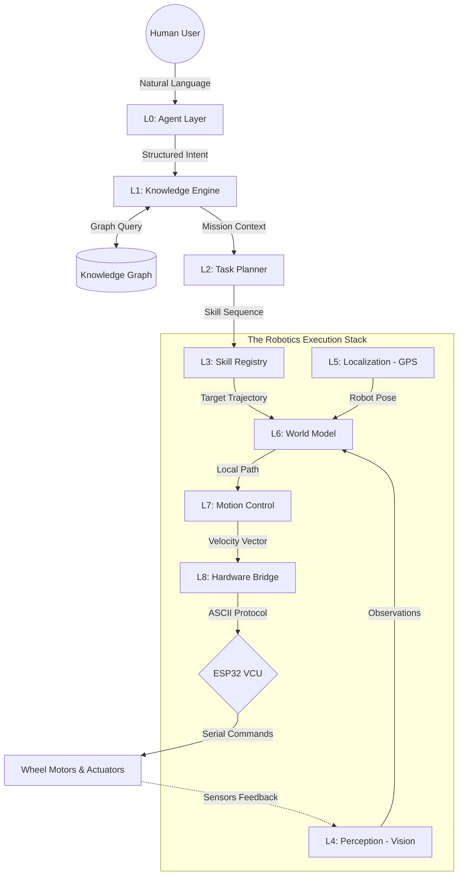

# BhoomiBot: AgentOS Architecture (The Complete Master Blueprint)

**Core Philosophy:** Don't just build a machine; build a **Learning Agent**. 
BhoomiBot is an **Operating System for Autonomous Robots** (AgentOS). It is built on the principle of **Cognitive Decoupling**: the high-level brain (which thinks and talks) is completely separated from the low-level robotics (which moves and senses). This allows the AI to grow smarter every day while the robot remains safe and deterministic.

---

## 1. The Global Vision: Why This Architecture?
In traditional robotics, if you want a robot to "Pick up a Mango," you have to write specific code for that. In **BhoomiBot AgentOS**, you "Teach" the robot what a mango is and how to pick it. The system then stores that as a **Skill**. 

This architecture allows a farmer to talk to the robot like a human colleague:
> *"BhoomiBot, please carry the organic fertilizer from the Shed to the Tomato Field. Do 5 trips, then go to the charging station."*

To make this possible, we use a **9-Layer Modular Stack**.

---

## 2. The Big Picture: Visual Data Flow

---

## 3. Detailed Layer Definitions (The 9 Pillars)

### L0: Agent Layer (The Translator)
*   **Responsibility:** To understand what the human wants.
*   **Analogy:** The robot's ears and mouth.
*   **How it works:** It uses an LLM (like Google Gemma or Gemini) to parse a messy human sentence into a clean JSON **Intent**.
*   **Junior Note:** If a user says "Go to the well," L0 doesn't know where the well is. It just says: `Goal(Action=NAVIGATE, Target="The Well")`.

### L1: Knowledge Layer (The Memory)
*   **Responsibility:** To store everything the robot "knows" about the world.
*   **Data Structure:** A **Knowledge Graph**. Instead of a list of numbers, it stores relationships.
*   **Hierarchy:** 
    *   **Farm Hub** (Root)
    *   **Zone:** Tomato Field (Property: Soil=Soft)
    *   **Zone:** Shed (Property: Contains=Fertilizer)
    *   **Path:** Shed to Field (Property: Distance=50m, Surface=Grass)
*   **Junior Note:** L1 is the layer that tells the Agent, "Hey, I don't know where 'The Well' is yet. Ask the user for help."

### L2: Task Planner (The Logic)
*   **Responsibility:** To break a big goal into a sequence of atomic steps.
*   **Logic:** Uses Behavior Trees or Finite State Machines.
*   **Example:** A "Carry Fertilizer" goal becomes:
    1.  `NAVIGATE(Shed)`
    2.  `ATTACH(Fertilizer_Tank)`
    3.  `NAVIGATE(Tomato_Field)`
    4.  `DETACH()`
*   **Junior Note:** The Planner never touches the motors. It only talks in "Skills."

### L3: Skill Registry (The Muscle Memory)
*   **Responsibility:** A library of "Standard Moves" the robot can perform.
*   **Capabilities:** `Navigate`, `Spray`, `Transport`, `Recharge`, `Follow_Human`.
*   **Contract:** Every skill must output a **Trajectory** (a list of GPS waypoints with speed targets).
*   **Junior Note:** If you want to add a new tool (like a Harvester), you just write a new `HarvestSkill` class here.

### L4: Perception Layer (The Eyes)
*   **Responsibility:** Real-time environmental awareness.
*   **Tech Stack:** TensorFlow Lite (TFLite), YOLO, OpenCV.
*   **Output:** A list of **Observations** (e.g., "Weed detected at 2 meters, 30 degrees right").
*   **Junior Note:** This layer only sees. It doesn't decide what to do. It just reports "There is a rock in front of me."

### L5: Localization Layer (The Map)
*   **Responsibility:** To answer the question: "Where am I precisely?"
*   **Tech Stack:** GPS (NMEA), IMU (Gyroscope/Accelerometer), and Wheel Encoders.
*   **Output:** A **Robot Pose** (Latitude, Longitude, Heading, and Speed).
*   **Junior Note:** This is the most critical layer for safety. If L5 fails, the robot is "blind" and must stop.

### L6: World Model (The Digital Twin)
*   **Responsibility:** To merge Vision (L4) and GPS (L5) into a single map.
*   **Feature:** **Temporal Persistence**. If the robot sees a rock, and then turns around, the World Model "remembers" that the rock is still there.
*   **Junior Note:** This is the layer where the "Auto-Steer" logic happens. It looks at the row of crops and calculates the center line.

### L7: Control Layer (The Physics)
*   **Responsibility:** To convert a "Path" into "Motor Power."
*   **Algorithm:** PID (Proportional-Integral-Derivative) or MPC.
*   **Logic:** If the robot is 10cm to the left of the path, L7 calculates exactly how much to turn the wheels to get back to the center.
*   **Junior Note:** L7 handles the "Smoothness" of the ride.

### L8: Hardware Layer (The Serial Bridge)
*   **Responsibility:** The final exit point.
*   **Protocol:** High-speed ASCII serial (e.g., `SPD50\n`, `DIR:L\n`).
*   **Interface:** Bluetooth Classic (SPP) or Wi-Fi TCP.
*   **Junior Note:** This is the only layer that knows the ESP32 exists. It is the "Muscle Contraction."

---

## 4. The "Teaching" Cycle: How the Robot Grows
This is the most important part of BhoomiBot. The system is designed to be **User-Taught**.

1.  **Instruction:** User says "Learn a new zone called The Mango Patch."
2.  **Missing Knowledge:** L1 checks the graph and finds zero data for "Mango Patch."
3.  **Interaction:** L0 (Agent) says: "I don't know the Mango Patch. Please drive me there once so I can map it."
4.  **Learning Mode:** User drives the robot manually. L5 (Localization) records the path.
5.  **Graph Update:** L1 creates a new **Node** in the Knowledge Graph with the label "Mango Patch" and attaches the recorded GPS coordinates.
6.  **Permanence:** This is saved to the local database. Next time, the robot knows exactly where to go.

---

## 5. Industrial Safety Design (The Watchdogs)
In AgentOS, safety is **Orthogonal**. This means the hardware is always watching the AI.

*   **Obstacle Watchdog:** If L4 (Perception) sees a human within 1 meter, it sends a high-priority signal directly to L8 (Hardware) to cut power, bypassing the AI's "Strategic Plan."
*   **Stall Watchdog:** If L5 (GPS) shows the robot hasn't moved for 5 seconds but L7 (Control) is trying to drive, the robot triggers an **Emergency Stop** and "Rings" the operator's phone.

---

## 6. Development Rules for Engineers
1.  **One Directional Flow:** Data should only flow down the stack (L0 -> L8). Feedback flows back up via Telemetry.
2.  **Don't Break the Contract:** If you update L4 (Vision), make sure your output is still a `List<Observation>`. This ensures the rest of the robot keeps working.
3.  **Use Singletons:** The VCU and Live Link connections must be **Singletons**. Never create a second connection to the same hardware.

---
*BhoomiBot: Future-Proof Agriculture. A techy in agri — built by engineers, for farmers.*
