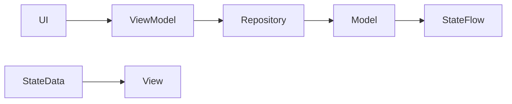

# Data Models Documentation

## Overview
BhoomiBot uses several data models for representing system state, robot properties, and communication content. These are primarily plain data classes without Android dependencies.

## Core Data Models

### 1. DriveCommand.kt
**Location**: `com.bhoomibot.os.model.DriveCommand`  
**Purpose**: Enumerates robot movement commands  
**Syntax**:  
```kotlin
enum class DriveCommand {
    FORWARD,          // Move forward
    REVERSE,         // Move backward  
    LEFT,            // Turn left
    RIGHT,           // Turn right
    STOP,            // Normal stop
    EMERGENCY_STOP   // Hard stop
}
```
**Usage**: Sent from operator to robot via `RobotRepository.sendDriveCommand()`

### 2. RobotStatus.kt
**Location**: `com.bhoomibot.os.model.RobotStatus`  
**Purpose**: Snapshots of robot health shown on dashboards  
**Fields**:
- `isOnline`: Connection status
- `batteryPercent`: 0-100% remaining
- `mode`: Current control mode ("Manual", "Autonomous")
- `mission`: Ongoing task name
- `gpsStatus`: Location status ("Connected", "No Signal")
- `cameraStatus`: Camera health
- `aiStatus`: AI decision system status

### 3. ConnectionConfig.kt
**Location**: `com.bhoomibot.os.connection.model.ConnectionConfig`  
**Purpose**: Configuration for Live Link sessions  
**Fields**:
- `serverUrl`: Relay server address
- `robotId`: Unique robot identifier
- `sessionCode`: Session authorization code
- `role`: OPERATOR or ROBOT
- `autoReconnect`: Auto-reconnect setting
- `videoFps`: Frames per second target
- `videoQuality`: Resolution quality setting

### 4. Communication Models
**Location**: `com.bhoomibot.os.connection.model.*`  
See subsections below:

#### LiveEnvelope.kt
- Wrapper for all JSON messages: `{type, robotId, ts, payload, ack, code, retry}`
- Used for all non-binary messages

#### LiveMessageType.kt
- Enum with: HELLO, VIDEO_FRAME, TELEMETRY, COMMAND, ACK, ERROR, PEER_STATUS, PING, PONG
- Provides `from(String?)` parse method

#### TelemetrySnapshot.kt (likely inferred)
- Detailed robot health snapshot
- May contain additional fields beyond RobotStatus

#### PeerStatus.kt
- Information about connected peers
- May include connection quality metrics

#### TelemetryMappers.kt
- Utilities for converting raw data to TelemetrySnapshots
- Likely contains decoding functions

#### LiveEnvelopeSerializer.kt
- Functions for converting between Java model and new object structures
- Adobe-specific JSON encoding/decoding utilities

#### LiveFrame.kt
- Contains JPEG byte arrays for video frames
- Designed to hold raw image data for transmission

#### Data Preferences Models
**Location**: `com.bhoomibot.os.data.*`  
**Models**:
- `ConnectionPreferences`: Stores connection type and settings
- `ControlCalibrationStore`: Holds operational calibration parameters
- `DevicePreferences`: User preferences for device settings
- `ControlCalibration`: Stores speed/step configurations

## Special Purpose Models
**Location**: `com.bhoomibot.os.model.*`

### MockRobotData.kt
- **Purpose**: Placeholder data for testing/unit testing
- **Content**: Simulated Battery, GPS, Telemetry status data

## Data Flow Architecture


## Key Design Principles
1. **Separation of Concerns**: Models are pure data structures
2. **South-Facing Interfaces**: Models used by ViewModels/Widgets but contain no Android dependencies
3. **Immutable State Management**: State changes are broadcast via flows
4. **Testability-Friendly**: Models can be instantiated without Android components
5. **Consistent Conventions**: Follow Kotlin naming and data class patterns

## Usage Contexts
- **RobotStatus**: Displayed on home screens
- **DriveCommand**: Used in drive control flows
- **ConnectionConfig**: Used in Live Link configuration
- **Telemetry Models**: Used in telemetry flows
- **MockData**: Used in unit testing scenarios

## Related Files (Inferred)
- `model/DriveCommand.kt`
- `model/RobotStatus.kt`
- `connection/model/CommandStructure.kt`
- `communication/model/LiveEnvelope.kt`
- `data/ControlCalibrationStore.kt`
- `data/DevicePreferences.kt`
- `data/LocalRobotRepository.kt`
- `mock/benchmark/MockTestData.kt`