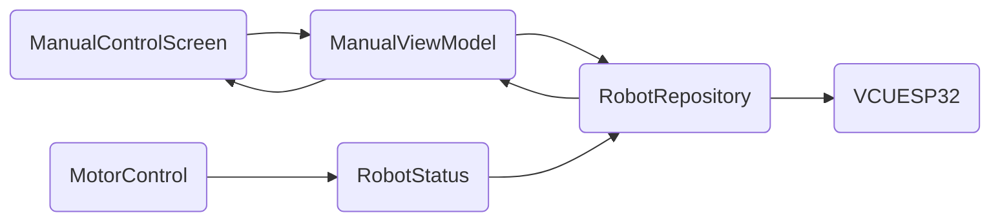

# Manual Control System Documentation

## Overview
The manual control system (ManualControlScreen) provides direct human operator control of the field robot through touch-based interfaces and physical controls.

## Primary Components

### 1. ManualControlScreen.kt (UI Layer)
- **Package**: `com.bhoomibot.os.feature.manual`
- **Core Elements**:
  - Digital drive buttons (FORWARD, LEFT, RIGHT, etc.)
  - Joystick control (drag for direction with magnitude-based speed)
  - Mode selector (DIGITAL vs JOYSTICK)
  - Status indicators and speed readouts
  - Quick controls (PTO, lights, horn, etc.)

### 2. ManualViewModel.kt (State Management)
- **Key Features**:
  - Real-time speed control (± meters per second)
  - Driving mode switching
  - Digital and joystick input handling
  - Emergency stop functionality
  - Calibration store integration

### 3. ManualUiState.kt (Data Model)
- **State Variables**:
  - `vehicleSpeedPercent` (signed for direction)
  - `ptoEnabled`, `ptoSpeedPercent`
  - `hydraulicEnabled`, `hydraulicHeightPercent`
  - `lightsEnabled`, `cameraLightEnabled`
  - `learningEnabled`, `isCameraMaximized`

## Technical Control Flow

1. **Input Processing**:
   - Digital buttons apply signed speed commands
   - Joystick calculates magnitude and direction from drag
   - Sliders snap to configured increments

2. **Command Execution**:
   - ViewModel calls `RobotRepository.sendDriveCommand()`
   - Speed commands routed through `toVcuPercent()` for scaling
   - Emergency stop bypasses normal flow

3. **Calibration Integration**:
   - `ControlCalibrationStore` provides:
     - Maximum speed limits
     - Drive/steer/hydraulic step increments
     - PTO step configurations

## UI/UX Features

### Digital Controls
- Cross-shaped layout of directional buttons
- Emergency stop prominently displayed
- Real-time speed display with color-coded warnings
- Camera preview integration with full-screen toggle

### Joystick Control
- Smooth curve-mapped speed response
- Axis-based direction detection
- Visual feedback with dragging knob
- Compact and expanded modes

### Quick Access Controls
- Single tap for PTO engagement
- Persistent settings across sessions
- Visual state feedback

## Communication Integration

### Command Flow
1. User touches/stroke on ManualControlScreen
2. Action calls ViewModel method (e.g., `onForward()`)
3. ViewModel updates state and calls `repository.sendDriveCommand()`
4. Command converted to ASCII protocol via `VcuProtocol.toProtocol()`
5. Sent via `ConnectionManager` to ESP32

### Live Link Integration
- Operator Role via `OperatorLiveViewModel`
- Remote camera feed displayed in main preview
- Live camera toggle controls both UI and robot state
- Connection state monitoring with retry logic

## Key Implementation Details

### Speed Calculation
```kotlin
// Convert meters/second to VCU percentage
private fun toVcuPercent(signedMetersPerSecond: Int): Int {
    val max = ControlCalibrationStore.calibration.value.maximumSpeedMetersPerSecond
    if (max == 0) return 0
    return (signedMetersPerSecond * 100 / max).coerceIn(-100, 100)
}
```

### Emergency Stop
```kotlin
fun onEmergencyStop() {
    repository.sendDriveCommand(DriveCommand.EMERGENCY_STOP)
    _uiState.value = _uiState.value.copy(
        vehicleSpeedPercent = 0,
        lastCommand = DriveCommand.EMERGENCY_STOP
    )
}
```

## System Architecture

### Repository Pattern
- **RobotRepository**: Interface abstraction
- **VcuRobotRepository**: Implementation with Bluetooth/WiFi support
- **LocalRobotRepository**: Fake/mock for testing

### Data Flow


## Current Limitations
- Joystick feedback is purely visual
- No vibration/tactile feedback implementation
- Advanced features like autonomous mode are placeholders
- Some components are reserved for future implementation

## Future Extension Points
- Advanced joystick customization
- Haptic feedback integration
- Multi-device synchronization
- Voice command integration

## Testing Considerations
- Unit tests for command conversion logic
- Integration tests for communication flow
- UI interaction automated tests
- Emergency stop verification critical path