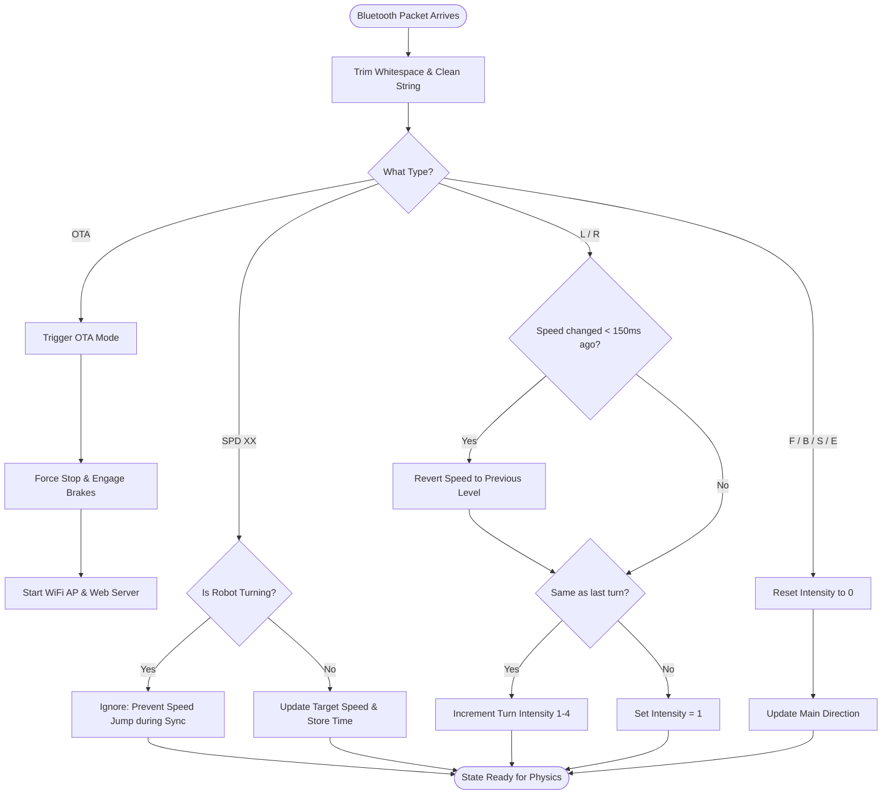
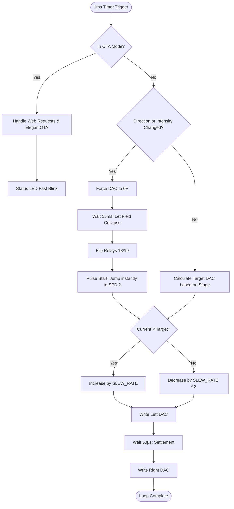

# BhoomiBot VCU: Complete Joystick Logic Architecture

This document breaks down the complex logic used to control the BhoomiBot. The system is split into three distinct processes: **The Command Parser**, **The Physics Engine**, and the **OTA Maintenance Mode**.

---

## 1. Process A: The Command Parser (Brain)
This process runs every time a Bluetooth packet arrives. It filters out "junk" data and prepares the robot's intended state.

---

## 2. Process B: The Physics Engine (Body)
This process runs strictly at **1000Hz (1ms)**. It ensures the motors never move in a way that damages the controllers or gearboxes.

---

## 3. The OTA Maintenance Mode
When the `OTA` command is received, the robot undergoes a **Safety Transformation**:

| Step | Action | Reason |
| :--- | :--- | :--- |
| **1** | **Total Stop** | Motors are cut to 0V and brakes are engaged. The robot MUST be stationary for safety. |
| **2** | **End Bluetooth** | Frees up the Radio for high-speed WiFi data transfer. |
| **3** | **Start WiFi AP** | Creates a local network named `BhoomiBot_Update`. |
| **4** | **Boot Web Portal** | Starts a web server at `192.168.4.1/update` for the technician. |

---

## 4. Key Engineering Timings

| Timing | Value | Why? (The Physics) |
| :--- | :--- | :--- |
| **Control Loop** | 1ms | Human reaction time is ~200ms. 1ms ensures the robot feels "Zero Lag." |
| **Arc Protection**| 15ms | Switching a relay under load creates a spark. 0V for 15ms saves the relay contacts. |
| **Transition Shield**| 150ms | Apps often send a speed bump *before* a turn. This 150ms window undoes that mistake. |
| **Slew Rate** | 5 units | Prevents the motor from "snapping" the gearbox teeth. |
| **OTA LED Pulse** | 200ms | Fast blinking provides clear visual confirmation of Maintenance Mode. |

---
*Documented by Meta-Engineer for BhoomiBot VCU Engineering Team.*
